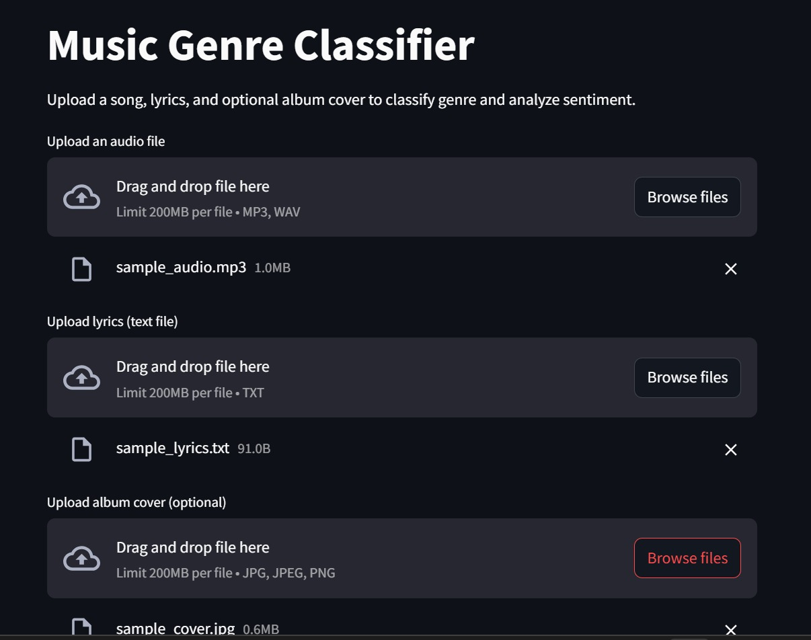
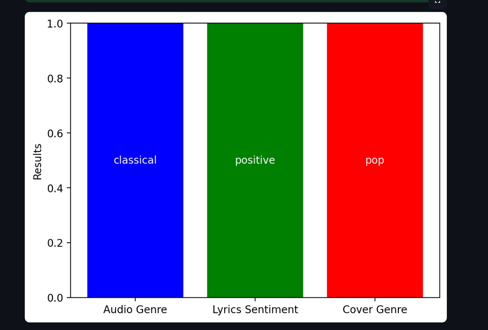

# 🎵 Music-Genre-Classifier

A Streamlit web application that classifies music genre and sentiment using a combination of audio files, lyrics text, and an optional album cover image. This multi-modal approach leverages different types of input data to give more accurate and enriched predictions.

---

## 🎤 1. Introduction

Music genre classification is a significant task in the field of music information retrieval. With the vast amount of music content generated daily, organizing, recommending, and analyzing music becomes challenging without intelligent categorization. This project explores a *multi-modal AI approach* by combining insights from audio signals, lyrical content, and visual album cover designs.

The integration of different media formats enhances the overall classification accuracy and mimics how humans perceive music — not just through sound, but also through lyrics and visual cues. This approach benefits music streaming platforms, digital libraries, recommendation systems, and music enthusiasts by enabling smarter categorization and sentiment insight.

---

## 🚀 2. Features

- 🎧 *Audio Genre Classification* — Detects music genre from MP3/WAV files.
- ✍ *Lyrics Sentiment Analysis* — Analyzes sentiment (positive, negative, neutral) from lyrics.
- 🖼 *Album Cover Genre Estimation* — Predicts the likely genre from a cover image.
- 📊 *Visualized Results* — Includes a colorful bar chart of predictions for quick insights.

---

## 🖼 3. Demo

  


---

## 🛠 4. Installation Steps

1. *Extract the Downloaded Folder*

   Download and unzip the project folder to your local machine.

2. *Install IntelliJ IDEA Ultimate*  
   - Download and install [IntelliJ IDEA Ultimate](https://www.jetbrains.com/idea/download/).
   - Make sure Python plugin is installed from Settings → Plugins.

3. *Open Project*  
   - Launch IntelliJ.
   - Open the extracted project folder.

4. *Install Dependencies*  
   - Open terminal or command prompt in the project root.
   - Run the following command to install all required libraries:

     bash
     pip install -r requirements.txt
     

5. *Run the Application*

   Use the command below to start the Streamlit app:

   ```bash
   streamlit run main.py
